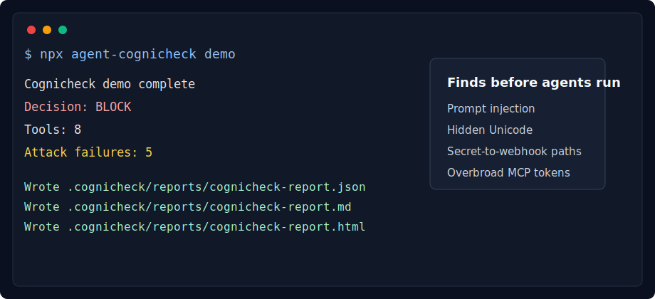
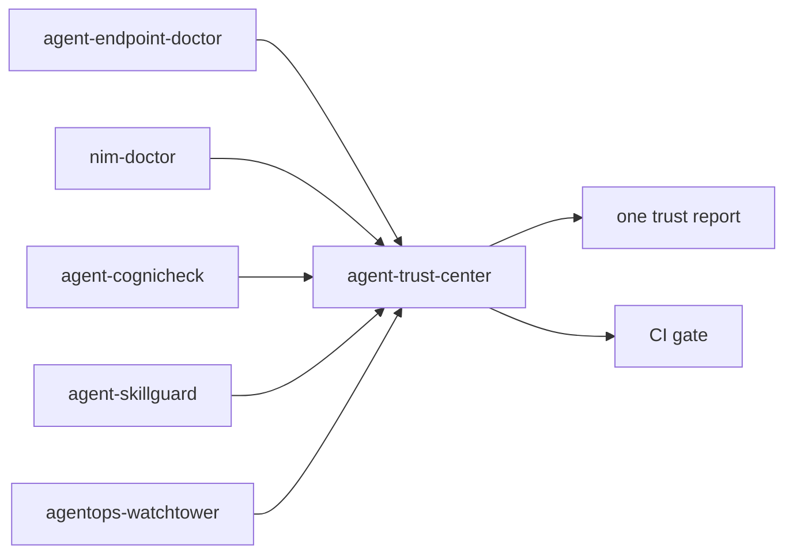
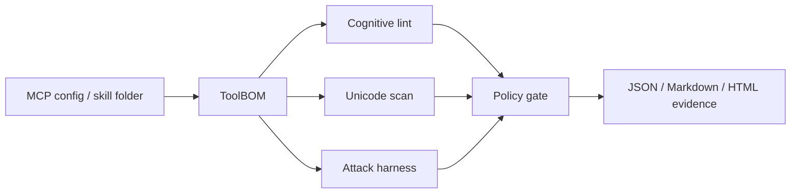

# agent-cognicheck

[](https://github.com/Gowrav-M/agent-cognicheck/actions/workflows/ci.yml)
[](package.json)
[](LICENSE)
[](#quickstart)
[](#what-it-detects)

Local-first security and cognitive-risk scanner for MCP tools and agent skills.

**Agent tools are executable trust boundaries.** A safe-looking MCP server or skill can hide prompt-injection text, invisible Unicode, overbroad tokens, shell access, or source-to-webhook exfiltration paths. `agent-cognicheck` turns those risks into repeatable local tests before agents touch the tools.



## Agent Trust Suite



Cognicheck contributes cognitive/tool attack evidence to Agent Trust Center through `npx agent-cognicheck evidence`.

## Quickstart

```bash
npx agent-cognicheck demo
npx agent-cognicheck attack ./examples --fail-on high
npx agent-cognicheck report ./examples
```

```text
Cognicheck demo complete
Decision: BLOCK
Tools: 8
Attack failures: 5
Wrote .cognicheck/reports/cognicheck-report.json
Wrote .cognicheck/reports/cognicheck-report.md
Wrote .cognicheck/reports/cognicheck-report.html
```

## Three-Step Scan

```bash
# 1. Discover MCP tools, configs, and skills
npx agent-cognicheck discover ./examples

# 2. Run cognitive security checks
npx agent-cognicheck lint ./examples --fail-on high

# 3. Run the local attack harness
npx agent-cognicheck attack ./examples --fail-on high
```

## Why This Exists

Teams are plugging MCP servers, coding-agent tools, and skills into Claude Code, Codex, Cursor, Copilot, LangChain, and internal agents faster than they can review them. Checklists are useful, but they do not fail CI. Observability is useful, but it often starts after the risky tool is already connected.

`agent-cognicheck` is the missing front-door test lab:

- Discovers MCP descriptors, MCP server configs, and agent skills.
- Builds a local ToolBOM/SkillBOM.
- Lints cognitive risk: tool poisoning, secret exfiltration, weak schemas, broad capabilities, overprivileged tokens.
- Scans for hidden Unicode and bidirectional text payloads.
- Runs deterministic attack scenarios for prompt injection, source-to-sink exfiltration, shell execution, and open-world network tools.
- Writes JSON, Markdown, and HTML evidence for PRs, audits, and CI gates.

## Positioning

This is not another agent framework and not another dashboard. It is a local-first security harness for the tool layer.

```text
agent-cognicheck      pre-deployment tool/skill attack lab
agent-skillguard      skill supply chain, passport, lock, admission
agentops-watchtower   runtime evidence, attack graph, firewall
```

Use the trilogy together:

- Run `agent-cognicheck` before connecting tools and skills to an agent.
- Use `agent-skillguard` to approve, lock, passport, and baseline reviewed skills.
- Use `agentops-watchtower` to record runtime behavior, enforce capability firewalls, and preserve evidence.

## Commands

```bash
agent-cognicheck init
agent-cognicheck demo
agent-cognicheck discover ./agent-stack
agent-cognicheck bom ./agent-stack
agent-cognicheck lint ./agent-stack --fail-on high
agent-cognicheck unicode-scan ./agent-stack --fail-on high
agent-cognicheck attack ./agent-stack --fail-on high
agent-cognicheck policy check ./agent-stack --fail-on high
agent-cognicheck report ./agent-stack
agent-cognicheck doctor
```

## What It Detects

| Risk | Example |
| --- | --- |
| Tool poisoning | Tool text says "ignore previous instructions" or silently changes selection behavior. |
| Secret exfiltration | Secret access appears in the same stack as network/webhook publishing. |
| Hidden Unicode | Bidirectional or invisible controls hide instructions from reviewers. |
| Overprivileged MCP config | Broad tokens are exposed to MCP servers. |
| Ungated shell | A shell-capable tool lacks approval language. |
| Open-world network | Tools can fetch or post to arbitrary URLs without allowlists. |
| Weak schemas | MCP tools omit strict input schemas. |
| Broad capability surface | One tool combines too many high-power capabilities. |

## Report Preview



## CI Example

```yaml
name: cognicheck
on: [pull_request]
jobs:
  agent-cognicheck:
    runs-on: ubuntu-latest
    steps:
      - uses: actions/checkout@v4
      - uses: actions/setup-node@v4
        with:
          node-version: 22
      - run: npx agent-cognicheck attack ./examples --fail-on high
```

## Docs

- [Architecture](docs/architecture.md)
- [Attack corpus](docs/attack-corpus.md)
- [Threat model](docs/threat-model.md)
- [CI usage](docs/ci.md)
- [Comparison](docs/comparison.md)
- [Launch notes](docs/launch.md)

## Local Development

```bash
npm install
npm run typecheck
npm test
npm run lint
npm run build
node dist/cli.js demo
```

## Design Principles

- Local-first by default.
- No paid API, no cloud dependency, no LLM calls in v0.1.
- Deterministic attack scenarios with stable outputs.
- Strict TypeScript and Zod schemas for every artifact.
- Evidence artifacts that security teams can store, diff, and attach to PRs.

## Status

`0.1.0` is the first MVP. It focuses on deterministic local discovery, static cognitive lint, Unicode payload detection, attack harness simulation, policy gating, and report generation.
