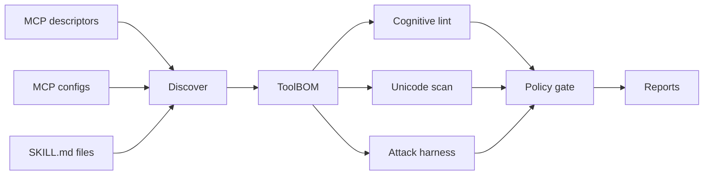

# Architecture

`agent-cognicheck` is built as a local-first CLI with deterministic analysis engines.

## Pipeline

## Core Modules

- `schemas.ts`: Zod schemas and TypeScript types for all evidence artifacts.
- `discover.ts`: MCP/tool/skill inventory and capability inference.
- `lint.ts`: static cognitive-risk rules.
- `unicode.ts`: hidden Unicode and bidirectional control detection.
- `attack.ts`: deterministic attack scenario evaluation.
- `policy.ts`: local policy gate.
- `report.ts`: JSON, Markdown, and HTML artifact generation.

## Non-Goals for v0.1

- No SaaS dashboard.
- No paid API dependency.
- No live exploitation of real services.
- No runtime proxy. Runtime enforcement belongs in `agentops-watchtower`.
